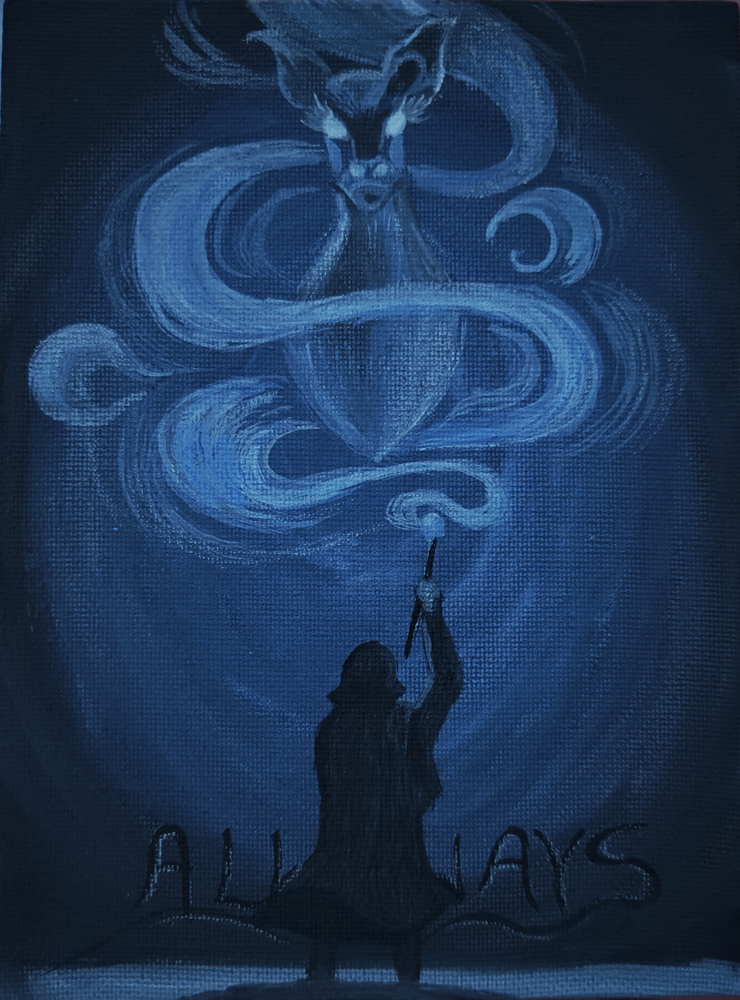
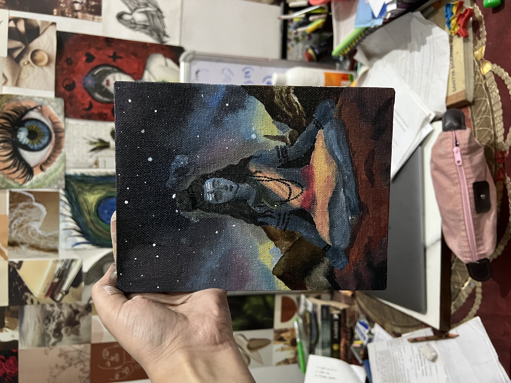
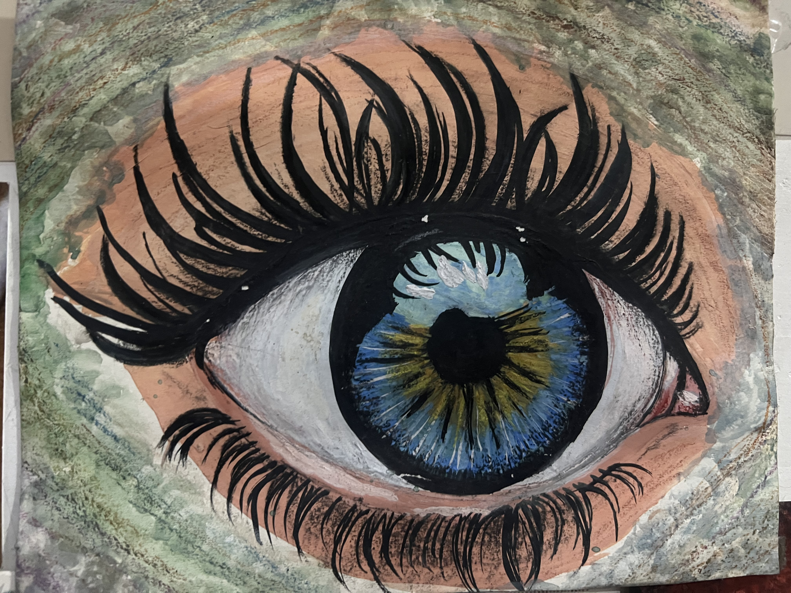
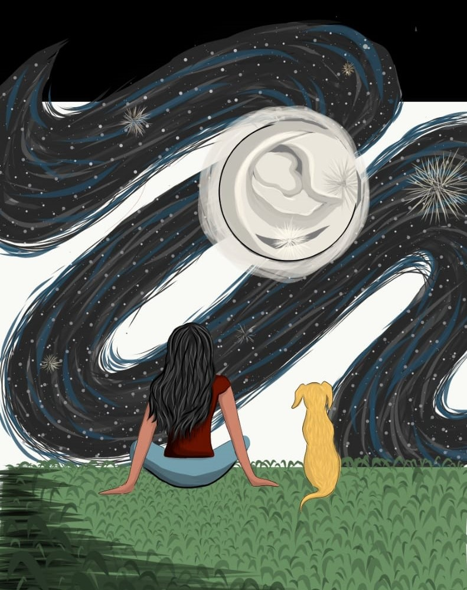

# Shruti Sharma

### Senior Software Engineer · Frontend Architect 

---

## ⚡ What I Do

> I build **scalable web systems** that serve millions — with a relentless focus on performance, clean architecture, and developer experience.
> Former **Google Developer Student Club Lead** @ Dronacharya College of Engineering

---

## 🛠️ Tech Stack

**Frontend**

**Backend**

**Infrastructure & Practices**

---

## 🔨 Featured Projects

<table>
<tr>
<td width="50%">

### [HydraRate](https://github.com/sj056/HydraRate)
**Distributed Rate Limiting for Node.js**

A production-grade NPM package implementing the Token Bucket algorithm with **Redis + Lua scripting** for atomic operations — preventing race conditions in high-concurrency environments.

`Node.js` `Redis` `Lua` `Express` `Distributed Systems`

</td>
<td width="50%">

### [Mindle](https://github.com/sj056/Mindle-client)
**AI-Powered Sentiment Monitoring System**

A Progressive Web App with **voice-based journaling**, real-time speech-to-text, and ML sentiment classification. Features Google OAuth, GraphQL APIs, and offline support.

`React` `GraphQL` `Apollo` `MongoDB` `NLP` `PWA`

</td>
</tr>
</table>

---

## 📊 GitHub Stats

---

## 🌱 Currently

- 🔭 Building scalable web systems
- 🎨 Painting & illustrating when away from keyboard

---

## 🎨 Beyond the Code

> I paint and illustrate — on canvas and digitally. Art is where I think differently.

<table>
  <tr>
    <td align="center" width="33%">
       
      <b>Always</b> · Acrylic on canvas
    </td>
    <td align="center" width="33%">
       
      <b>Cosmic Shiva</b> · Acrylic on canvas
    </td>
    <td align="center" width="33%">
       
      <b>The Eye</b> · Mixed media
    </td>
  </tr>
  <tr>
    <td align="center" width="33%">
       
      <b>Stargazing</b> · Digital illustration
    </td>
    <td align="center" width="33%">
       
      <b>The Lamp</b> · Digital illustration
    </td>
    <td align="center" width="33%">
       
      <b>Angel</b> · Digital illustration
    </td>
  </tr>
</table>

---

*"Good software is built at the intersection of performance, scalability, and craft."*

